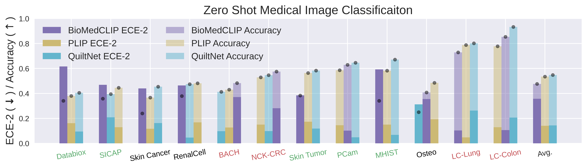

# On Calibration of Modern Medical Vision-Language Models

## Approach

An extensive empirical investigation across different models, datasets, and prompting
strategies showed that medical vision-language models tend to be largely unreliable out-of-the-box in the zero-shot setting.

## Setup

Requires python >= 3.10, [uncertainty calibration](https://pypi.org/project/uncertainty-calibration/) library, and [OpenAI's CLIP](https://pypi.org/project/open-clip-torch/) library.
